
# PRÁCTICA 2 DE FSI
> - Redes neuronales aplicadas a clasificación de conjuntos de imágenes
> - Realizado por Carlos Alonso Rodríguez e Imanol Quintero Bermúdez

Esta práctica tiene como objetivo el desarrollo de una red neuronal efectiva para la clasificación de conjuntos de imágenes. Para lograrlo, se busca comprender y aplicar los conceptos esenciales de aprendizaje profundo, desde la selección adecuada de la arquitectura de red hasta la implementación de técnicas de preprocesamiento de datos. Se pretende entrenar la red utilizando un conjunto diverso de imágenes, permitiendo que el modelo aprenda a reconocer patrones y características distintivas en las diferentes clases de interés. Además, se busca optimizar los hiperparámetros del modelo y evaluar su rendimiento utilizando métricas pertinentes. Al finalizar la práctica, se espera no solo haber creado una red neuronal capaz de clasificar imágenes con precisión.

## Conjunto de imágenes elegido
El [dataset](https://www.kaggle.com/datasets/misrakahmed/vegetable-image-dataset) de imágenes escogido representa quince categorías distintas de verduras. El conjunto resulta ideal para nuestro cometido, pues cuenta con un gran número de fotografías, con una distribución que resulta ideal para el entrenamiento y aprendizaje de nuestra red, y que sigue, aproximadamente, la relación 70-20-10 (1000 imágenes en cada categoría del directorio “Training”, 200 en el directorio “Validation” y 200 en el directorio “Test”). Asimismo, se han evaluado los datos para comprobar que no siguen el mismo formato, como fondos blancos, que pueden resultar perjudiciales para el amaestramiento de la red.

## Ejecuciones de la red neuronal
Para poner en funcionamiento la red neuronal, se ha hecho uso de la web de procesamiento en línea [Kaggle](https://www.kaggle.com/), que ofrece distintas herramientas, tales como GPU, que resultan muy beneficiosas para los objetivos que planteamos (mayormente concurrencia), y librerías asociadas que ayudarán a aprovechar al máximo la gráfica.
Respecto al código propuesto por el profesor, se han cambiado finalmente varios hiperparámetros, como la convolución de las capas, los valores de ***Max Pooling***, y la capa ***Dense***. No obstante, a fin de mejorar el resultado, se ha tenido en cuenta el posible gasto de recursos adicional, así como el sobreajuste cada vez que se ha llevado a cabo alguna modificación, aunque esto último no ha significado un problema relevante, ya que el conjunto cuenta con una gran variedad de imágenes de entrenamiento.
No obstante, para validar los hiperparámetros elegidos, se han realizado diversas ejecuciones con distintos valores de hiperparámetros.
A continuación, se muestran los valores de precisión y la gráfica de pérdida y precisión obtenida para las diferentes combinaciones de hiperparámetros probados:

- 1ª ejecución, con capas convolutivas a 32, 64 y 128, *Max Pooling* a 2, *Dense* a 128:
  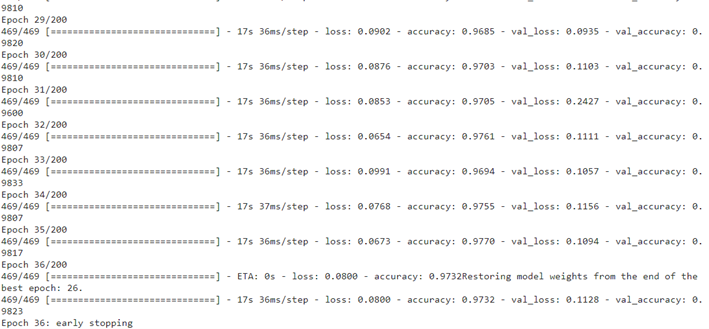
  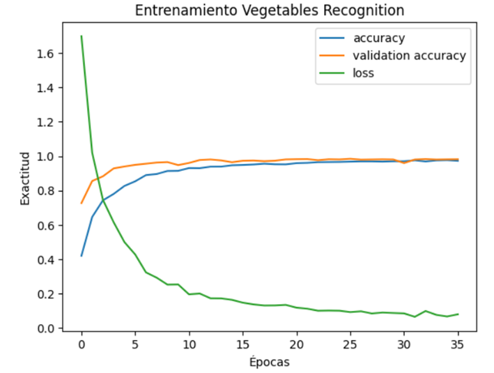
- 2ª ejecución, con capas convolutivas a 32, 64 y 128, *Max Pooling* a 2, *Dense* a 128:
  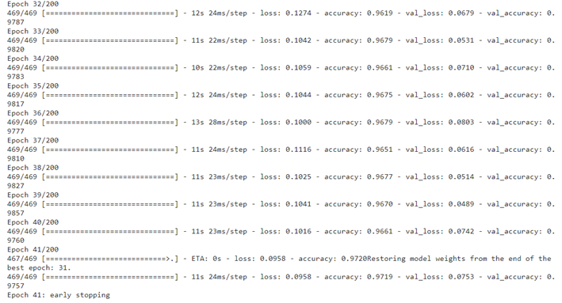
  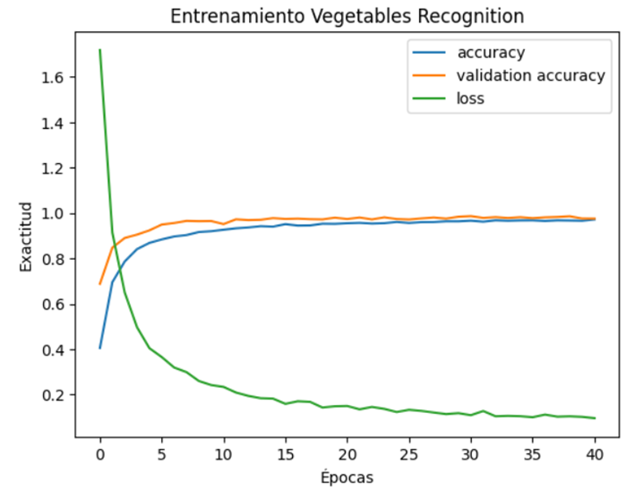
- 3ª ejecución, con capas convolutivas a 32, 64 y 128, *Max Pooling* a 2, *Dense* a 128:
  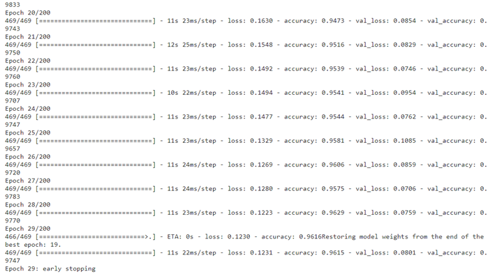
  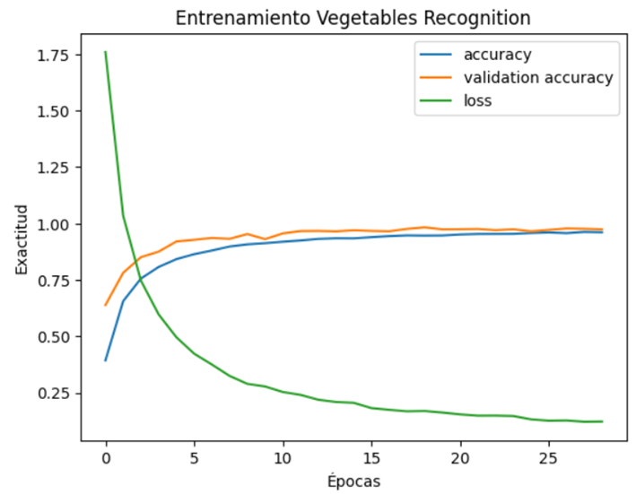
- 4ª ejecución, con capas convolutivas a 32, 64 y 128, *Max Pooling* a 2, *Dense* a 128:
  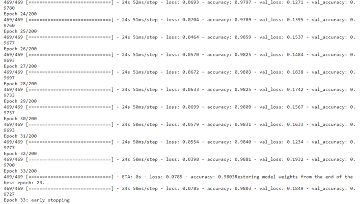
  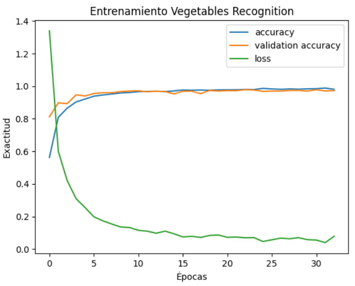
- 5ª ejecución, con capas convolutivas a 32, 64 y 128, *Max Pooling* a 2, *Dense* a 128:
  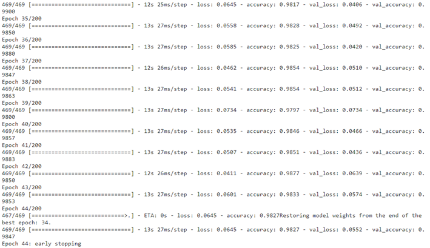
  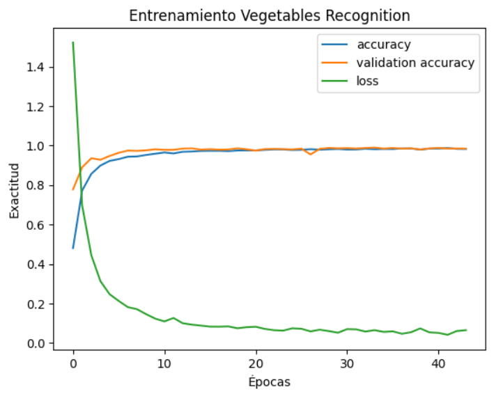
- 6ª ejecución, con capas convolutivas a 32, 64 y 128, *Max Pooling* a 2, *Dense* a 128:
  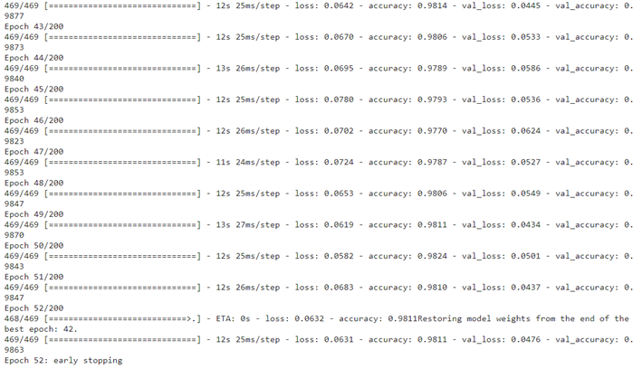
  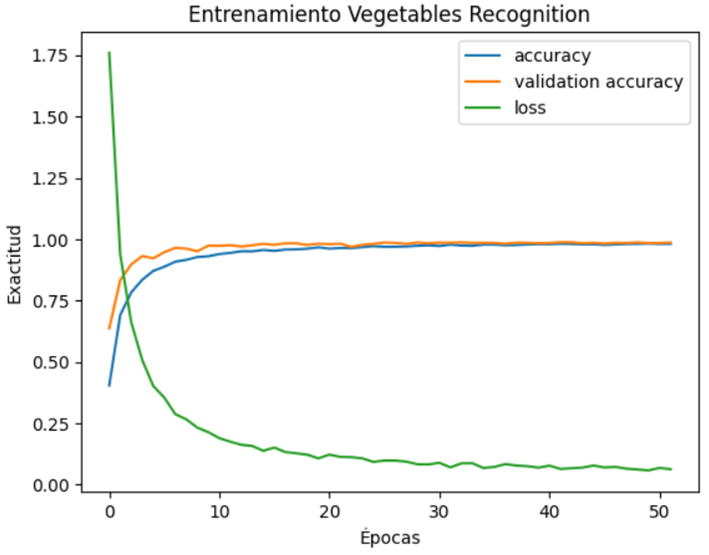

Finalmente, se ha decidido elegir los hiperparámetros de la última ejecución, pues parecen ser los más avanzados en términos de exactitud.
Cabe destacar que se ha generado la matriz de confusión, que ayuda a evaluar el rendimiento de los modelos de aprendizaje automático, y que proporciona una visión detallada de su eficacia para cada clase.
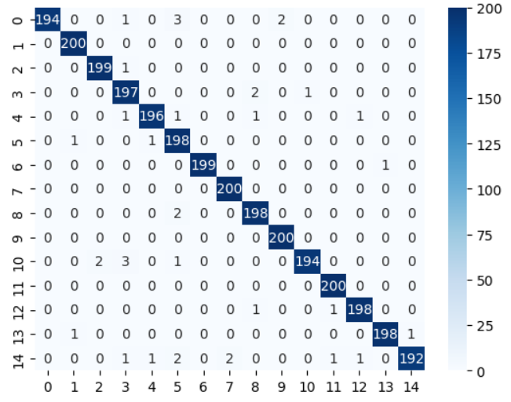
